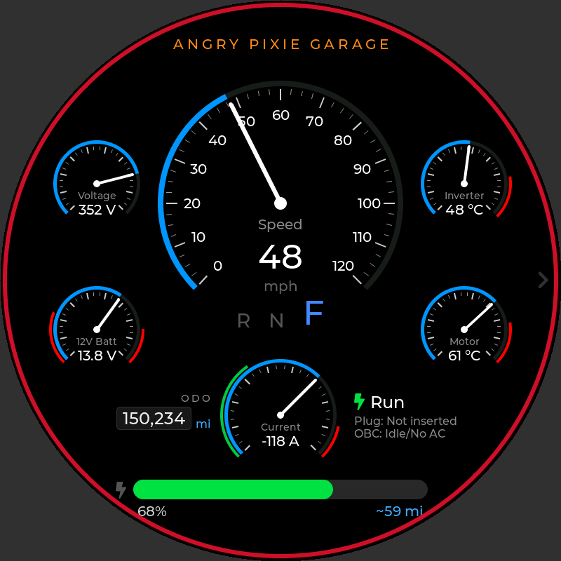
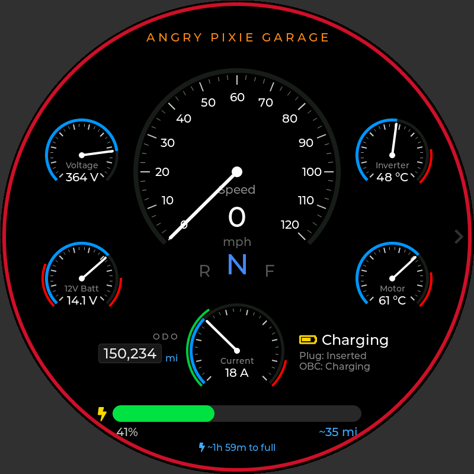
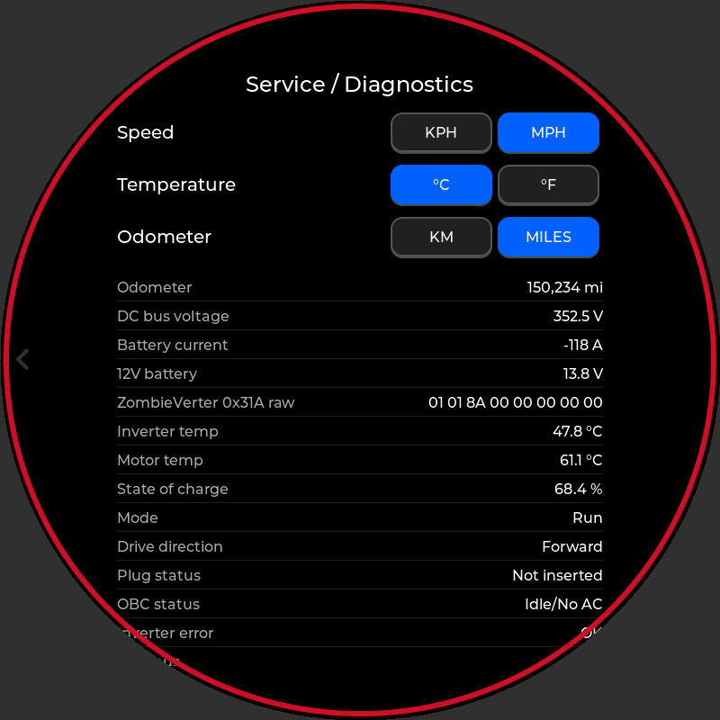
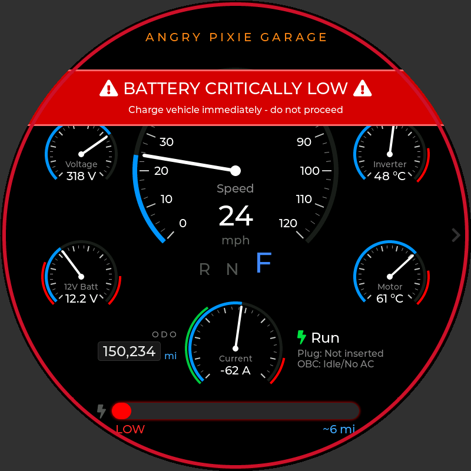
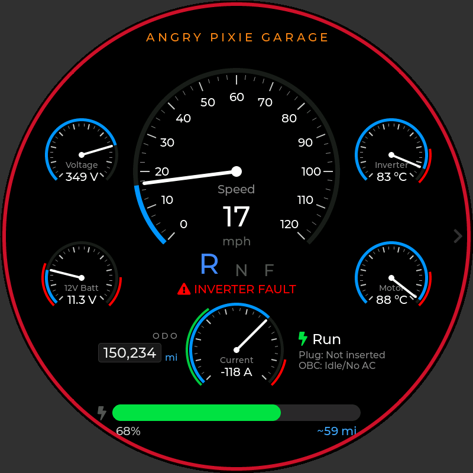
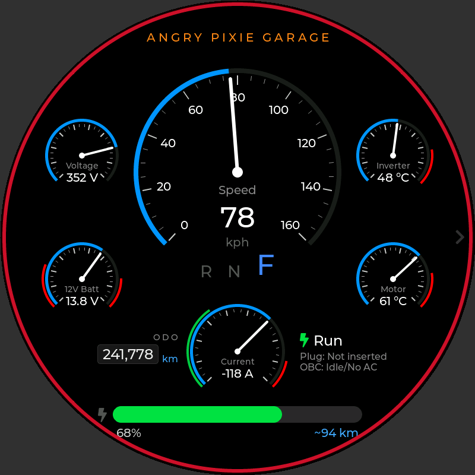

# 928 Waveshare Dash

Dash display for the Porsche 928 EV conversion, running on the
**Waveshare ESP32-P4-WIFI6-Touch-LCD-3.4C** (3.4" round 800×800 touch display).

This is a port of the [Angry Pixie web dash](https://github.com/bapshago/AngryPixieDash)
(`leaf_dash_v9`). The CAN decoding, gauges, warnings, odometer and settings are
the same, but instead of an ESP32 serving a web page to a tablet, the data is
drawn straight onto the round screen with LVGL.

| Driving | Charging | Service / Diagnostics |
|---|---|---|
|  |  |  |

| Critically low battery | Inverter fault, reverse | Metric units |
|---|---|---|
|  |  |  |

*Screenshots are rendered by the desktop simulator (`sim/`) from the same UI code
the board runs; the grey corners are outside the round glass.*

## Features

Carried over from the web dash:

- Large speed gauge, kph (0–160) or mph (0–120)
- Small gauges: pack voltage, 12V aux battery (red below 11.5 V / above 15 V),
  inverter and motor temperature (°C 0–90 / °F 0–200, red in the top 20 %)
- Inverted current gauge: throttle swings clockwise to −250 A, regen to +150 A,
  green regen zone, 200–250 A redline
- R / N / F drive direction and op mode (Off, Run, Pre Charge, Pre Charge Failed, Charging)
- State-of-charge bar with range estimate (22 kWh pack, 3.9 mi/kWh); red below 15 %
- **Critical low-battery warning below 10 %**: flashing banner, bar and "LOW" readout
- Estimated time to full while charging
- Plug and on-board charger status; flashing inverter fault warning
- Odometer (miles or km), seeded to 150,000 miles on first boot and integrated from motor speed
- Service / Diagnostics screen (swipe left) with speed, temperature and odometer unit
  toggles and raw readings, including the ZombieVerter 0x31A frame in hex
- Unit settings and the odometer persist in flash (NVS); the odometer is written at
  most every 30 s to limit flash wear
- Red bezel ring to match the car's anodized gauge bezels

New on the round display:

- Needles ease between readings (the web page used a CSS transition)
- CAN bus state, frame counters and "last frame" age on the service screen
- 12V gauge shows one decimal (13.8 V rather than 14 V)

## Hardware

| Part | Notes |
|---|---|
| Waveshare ESP32-P4-WIFI6-Touch-LCD-3.4C | ESP32-P4, 32 MB PSRAM, 32 MB flash, 800×800 MIPI-DSI round IPS, capacitive touch |
| 3.3 V CAN transceiver, e.g. TI SN65HVD230 | The ESP32-P4 has an on-chip CAN (TWAI) controller but no transceiver |
| 12 V → 5 V supply | Powers the board through its USB-C port |

Wiring (defaults; change them in `idf.py menuconfig` → *928 EV Dash*):

| 40-pin header | SN65HVD230 | |
|---|---|---|
| GPIO5 | D (TXD) | CAN TX |
| GPIO4 | R (RXD) | CAN RX |
| 3V3 | VCC | |
| GND | GND | |
| | CANH / CANL | to the EV-CAN bus (ZombieVerter, Leaf inverter, PDM, BMS) |

GPIO4 and GPIO5 are adjacent pins on the board's 40-pin header, and nothing else
on the board uses them. Check the header silkscreen before wiring. The bus should
already be terminated at both ends; only add a 120 Ω terminator if the dash is at
one end of the bus.

## CAN messages read (500 kbit/s)

| ID | Data |
|---|---|
| 0x1DA | DC bus voltage, motor speed, inverter error |
| 0x55A | Inverter and motor temperature |
| 0x390 | OBC / charge plug status |
| 0x55B | State of charge |
| 0x1DB | Battery current |
| 0x31A | ZombieVerter: drive direction, op mode, 12V aux voltage. Needs custom TX mappings, see [docs/ZombieVerter_CAN_Mappings.md](docs/ZombieVerter_CAN_Mappings.md) |
| 0x292 | 12V battery voltage (stock Leaf CAR-CAN, if present) |

## Building and flashing

Requires [ESP-IDF](https://docs.espressif.com/projects/esp-idf/en/latest/esp32p4/get-started/)
**v5.5 or newer**. The Waveshare BSP and LVGL are fetched automatically by the
component manager on the first build.

```sh
idf.py set-target esp32p4
idf.py build
idf.py -p /dev/ttyACM0 flash monitor     # COMx on Windows
```

Options under `idf.py menuconfig` → **928 EV Dash**:

| Option | Default | |
|---|---|---|
| CAN TX / RX GPIO | 5 / 4 | Transceiver pins |
| CAN bitrate | 500000 | |
| Listen-only | off | On = the dash never ACKs or transmits. Leave off on a bench with only one transmitter |
| Test mode | off | Animated fake data, no CAN needed (the web dash's `TEST_MODE`) |
| Backlight brightness | 100 % | |

The defaults target ESP32-P4 silicon rev 3.x, like Waveshare's examples. For
an older pre-v3 chip, build with
`idf.py -D SDKCONFIG_DEFAULTS="sdkconfig.defaults;sdkconfig.defaults.rev1_3" build`.

Drivetrain constants (gear ratio 7.94, tyre circumference 1.975 m, 22 kWh pack,
3.9 mi/kWh, initial odometer) are at the top of `main/core/dash_calc.h`.

## Previewing the screen without hardware

The simulator builds the same UI code for the PC and writes PNG screenshots.
It needs a C compiler and CMake:

```sh
cmake -S sim -B build-sim && cmake --build build-sim -j
./build-sim/dash_sim drive out.png          # one scenario
./build-sim/dash_sim --all docs/screenshots  # all of them
```

Scenarios: `drive`, `regen`, `charging`, `lowbatt`, `fault`, `nodata`,
`metric`, `service`, `test`. They're built from synthetic CAN frames run
through the real decoder, so they exercise the same path as the car.

## Tests

The CAN decoder and calculations are plain C and are tested on the PC:

```sh
cmake -S host_test -B build-test && cmake --build build-test && ./build-test/test_core
```

## Layout

```
main/
  main.c            boot: settings + CAN, then display + UI
  dash_model.c      ESP32 side: TWAI receive, NVS settings/odometer, test mode
  core/             portable C, no ESP-IDF: state, Leaf/ZombieVerter decoder, calculations
  ui/               LVGL: gauge widget, driver + service screens
sim/                desktop renderer (LVGL on the PC → PNG)
host_test/          unit tests for main/core
docs/               screenshots, ZombieVerter CAN mapping guide
```

## Differences from the web dash

- **Battery current sign fix:** 0x1DB decoding now subtracts 2048 for negative
  values (the web dash subtracted 2047, so every negative reading was 1 A too high).
- **No false low-battery alarm at key-on:** SOC, pack voltage and current show
  "--" until their first CAN frame arrives. The web dash treated a missing SOC
  as 0 %, which flashed the critical-battery banner whenever data was missing.
- **Odometer display:** miles are computed as metres ÷ 1609.344 instead of
  km × 0.621371, which rounded 150,234 down to 150,233.
- **Current scale unchanged:** 0x1DB current is used at 1 A/bit, exactly as the
  web dash did. Some Leaf decodes list this signal as 0.5 A/bit, so compare the
  gauge with a clamp meter or your BMS and adjust `leaf_can.c` if it reads double.
- **Settings don't carry over:** the NVS namespace and keys match the web dash,
  but this is a different board, so the odometer seeds fresh at 150,000 miles.
  Change `DASH_ODO_INITIAL_MILES` before first boot to start from the car's real reading.
