# Mechanical parts (laser cut)

Cut files for the dash pod and electronics brackets. The DXF drawings are in
millimetres.

| File | Part | Qty (both units) | Material | How it's made |
|---|---|---|---|---|
| `SCS_MainInstrumentFaceplate_RV1_1.dxf` | Main instrument faceplate: two 90 mm gauge openings, mounting tab each end (416 × 120 mm flat) | 1 | 16 gauge (1/16") cold rolled steel | SendCutSend, then bent (below) |
| `SCS_WaveshareMountingBracket_RV1_1.dxf` | Waveshare mounting bracket: joins a Waveshare screen to the back of the faceplate (33 × 10 mm flat, two 4.5 mm holes) | 8 | 16 gauge (1/16") cold rolled steel | SendCutSend, then bent (below) |
| `SCS_BuckConverterForDash_Plate_V1_1.dxf` | Buck converter bracket, **6 round holes**: four 3 mm for the M2.5 standoffs, two 4.5 mm for M4 (attaches to the screen; flat, no bends) | 2 | 1/16" ABS | Laser cut |
| `SCS_CanBusWireBracket_V1_1.dxf` | CAN bus wire bracket, **2 round holes** (4.5 mm for M4) plus zip-tie slots; 24.8 × 88 mm (attaches to the screen; flat, no bends) | 2 | 1/16" ABS | Laser cut |
| *(no file: hand formed)* | Shroud: strip formed around the faceplate to meet the pod face | 1 | 18 gauge cold rolled steel, 3" × 31" strip | Hand formed, welded to the faceplate (below) |

## Ordering the steel parts from SendCutSend

Upload `SCS_MainInstrumentFaceplate_RV1_1.dxf` and
`SCS_WaveshareMountingBracket_RV1_1.dxf` (quantity 8), confirm the units are
**millimetres** when the part preview loads (the faceplate should show about
416 × 120 mm),
and choose **cold rolled steel, 16 gauge**. SendCutSend's 16 ga steel is nominally
0.060" (1.52 mm), close enough to 1/16" (0.0625") for these parts.

## Bending the main instrument faceplate

Each end of the faceplate has a tab with a 6.5 mm hole near its top. Bend each tab
**90°** on a line **20 mm down from the top edge of the tab** (the end with the
hole). The tab is free of the main plate for its top 25 mm, so the bend line sits
5 mm above where the tab joins the faceplate; the 20 mm flap with the hole is what
folds over.

## Bending the Waveshare mounting brackets

Two 90° bends in opposite directions make a **5 mm jog** (a Z shape):

1. **Bend 1:** 2 mm in from the edge of one hole, toward the middle of the part
   (about 9.3 mm from that end).
2. **Bend 2:** 5 mm past bend 1 (about 14.3 mm from the same end), back the other
   way, so the two hole ends finish parallel and 5 mm apart.

The holes sit almost exactly symmetric on the strip, so either end can be the start.

## Shroud

The shroud closes the gap between the faceplate and the face of the 928 instrument pod.
It isn't a cut file: it's hand formed from a **3" × 31" strip of 18 gauge cold
rolled steel**, using the pod as the guide.

1. **Position:** the shroud runs just inside the four inner M4 bolt holes on the faceplate
   (185 mm and 230 mm from the left end), and about 10 mm inside the four outer
   holes (110 mm and 305 mm from the left end).
2. **Measure your pod:** bolt the faceplate into the pod and measure from the edge of the faceplate
   to the face of the pod at several points around it. On the first car the
   shroud was **10 mm** at its smallest and **33 mm** at its largest, with the
   trim cut at roughly **20°**. Other pods may differ, so measure yours rather
   than copying these numbers.
3. **Make a template first (recommended):** cut a 3" × 31" strip of posterboard,
   form it around the faceplate inside the pod and trim it until it meets the pod face all
   the way round. Then trace it onto the steel strip and cut. This gets an exact
   fit before any metal is cut.
4. **Form and close:** hand form the strip to shape against the pod and trim it to
   your measurements. Then weld the two ends of the strip together.
5. **Tack weld** the shroud to the faceplate, refit it in the pod and confirm the fit.
6. **Stitch weld** the shroud to the faceplate once the fit is right.
7. **Finish:** prep for paint, then epoxy primer and a **matte black** top coat.
   Matte black keeps reflections off the screens.

## Assembly stack

Each unit stacks from the front of the car backwards:

1. **Main instrument faceplate.** One faceplate carries both screens, one per
   gauge opening.
2. **Waveshare screen**, face forward through the opening.
3. **ABS brackets** (buck converter bracket and CAN bus wire bracket) against
   the back of the screen.
4. **Four Waveshare mounting brackets** over the ABS brackets. One end of each bracket
   screws into the screen through the ABS brackets. The 5 mm jog brings the other
   end forward onto the faceplate, where it bolts on.

## Power

The buck converter's 5 V output has a USB-C cable soldered on, which plugs into
the Waveshare screen. Before plugging it into the screen, set the output to
**5 V** and **check the polarity** at the USB-C end.

## Assembly hardware

| Joint | Hardware |
|---|---|
| Waveshare mounting bracket to the Waveshare screen, clamping the ABS brackets | M4 × 5 mm screws |
| Waveshare mounting bracket to the back of the faceplate | M4 bolts, flat washers, lock washers and nuts |
| Buck converter to its ABS bracket | M2.5 × 5 mm standoffs, screws and nuts |
| Wires to the brackets | Small zip ties through the notches in the brackets |

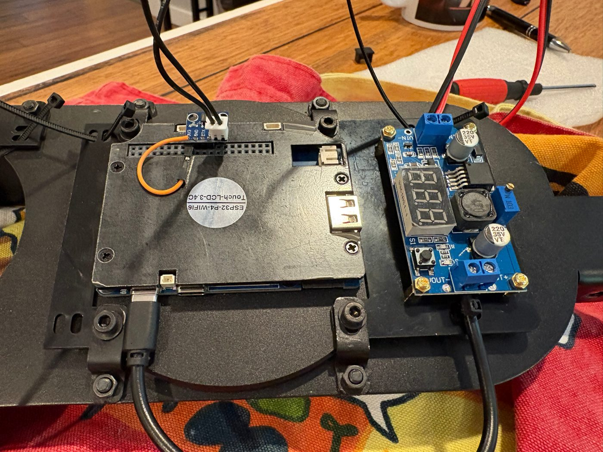

*Back of the faceplate with one unit fitted:*
- *The Waveshare screen sits over a gauge opening, held by four Waveshare mounting brackets (two M4 fasteners each).*
- *The SN65HVD230 CAN transceiver plugs onto the screen's GPIO header.*
- *The LM2596 buck converter sits on M2.5 standoffs to the right.*
- *Zip ties through the bracket notches hold the wiring.*

Full assembly steps will be added with the build guide.

## Build photos

In build order. All photos are in `photos/`.

**Test fit of the flat faceplate in the original 928 instrument pod**, with
one screen on its four Waveshare mounting brackets. The second opening shows the
bracket holes before its brackets go on.

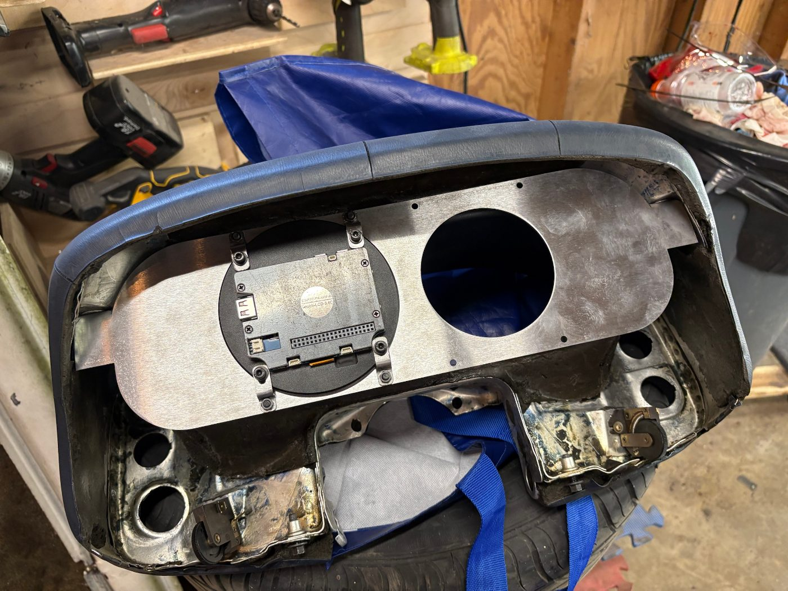
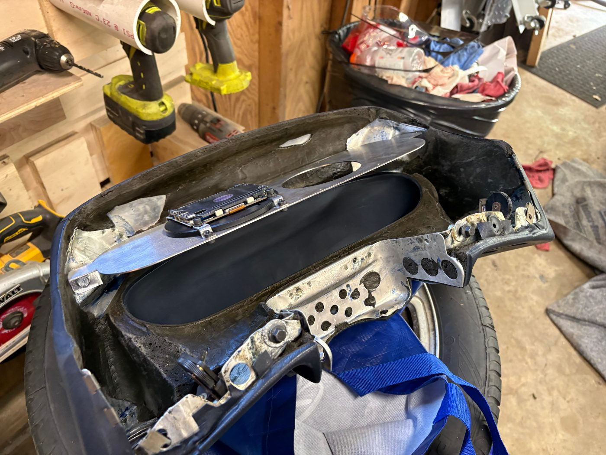

**Back of the faceplate** with the Waveshare mounting brackets bolted on (M4 bolts, washers, lock
washers and nuts) and the end tabs bent.

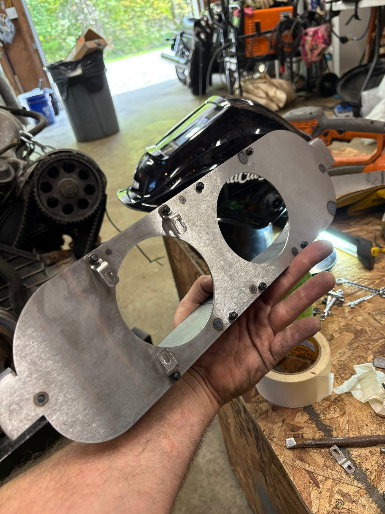

**Steel shroud** (see [Shroud](#shroud)), hand formed, ends welded, then tacked and
stitch welded to the faceplate.

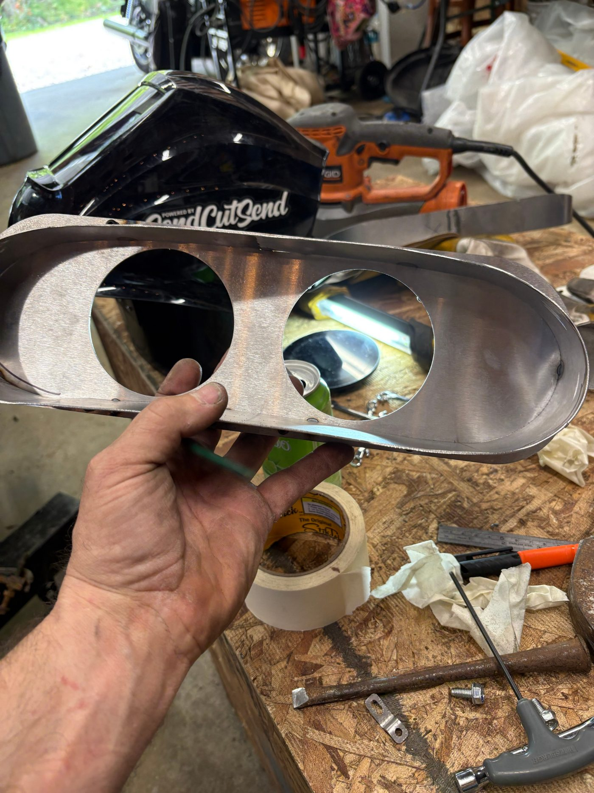
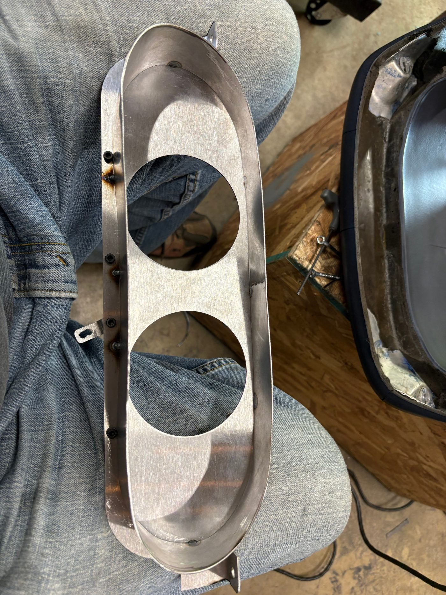
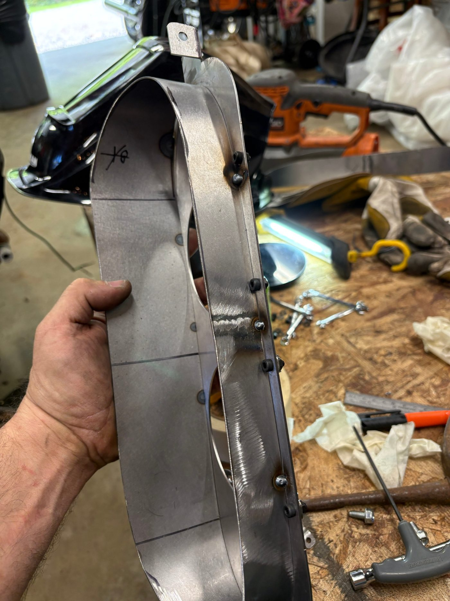
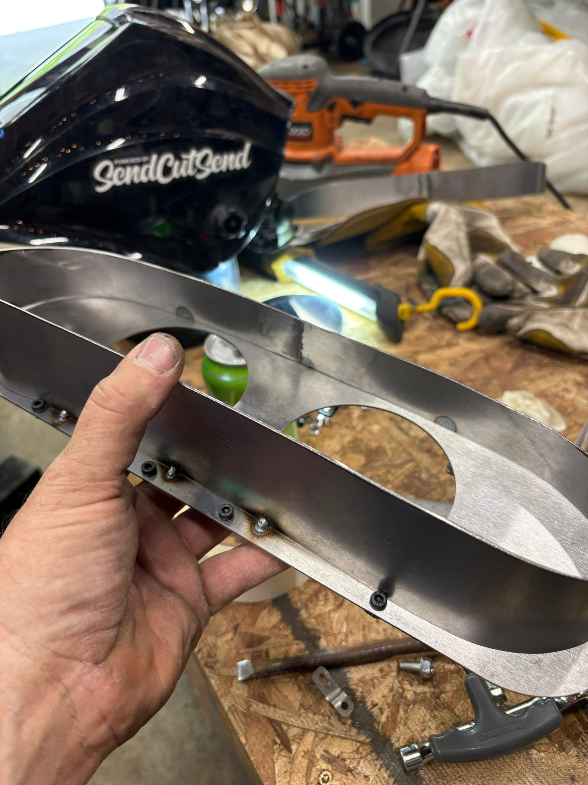
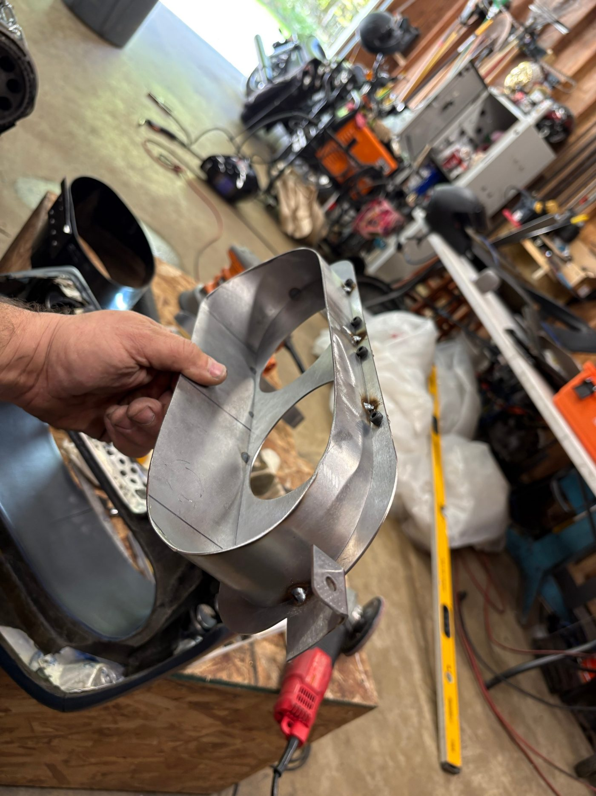

**Paint:** the faceplate and the eight Waveshare mounting brackets, then the pod in grey epoxy primer. The final top coat is matte black.

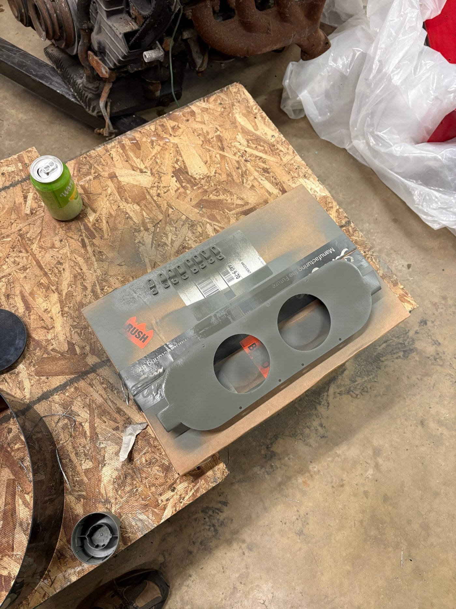
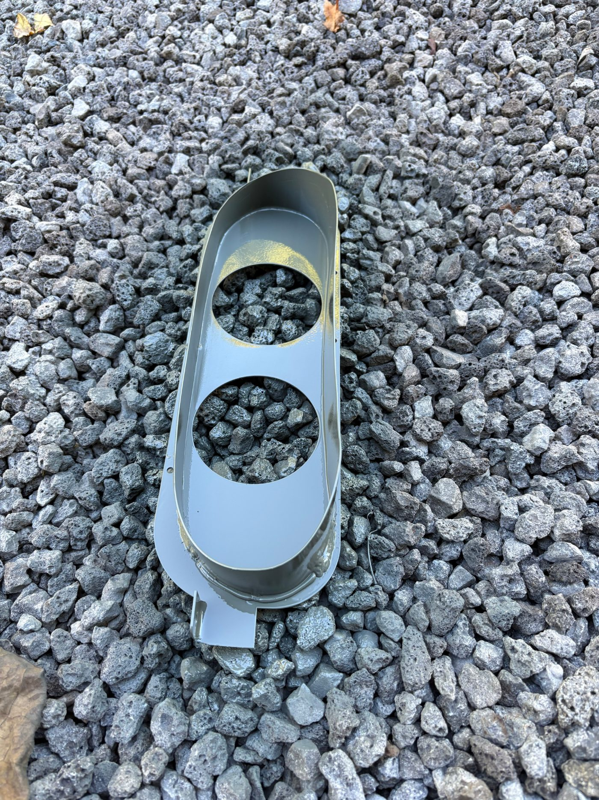
