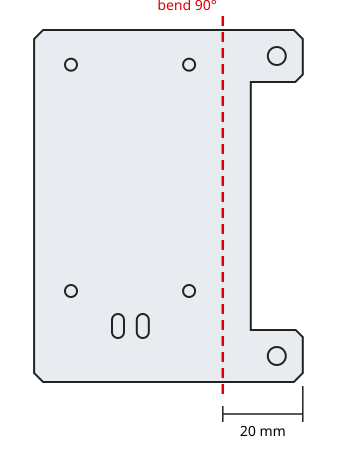

# Mechanical parts (laser cut)

Cut files for the dash pod and electronics brackets. The DXF drawings are in
millimetres.

| File | Part | Material | How it's made |
|---|---|---|---|
| `InstrumentClusterBracket1_v1_1.dxf` | Instrument cluster bracket | 16 gauge (1/16") cold rolled steel | Ordered cut from SendCutSend |
| `SCS_BuckConverterForDash_Plate_V1_1.dxf` | Buck converter mounting plate | 1/16" ABS | Laser cut |
| `SCS_BuckConverterForDash_Plate2_V1_1.dxf` | Buck converter mounting plate 2 | 1/16" ABS | Laser cut |
| `CanBusCableHolder.xcs` | CAN bus cable management holder | 1/16" ABS | Laser cut (xTool Creative Space project) |

## Ordering the steel bracket from SendCutSend

Upload `InstrumentClusterBracket1_v1_1.dxf`, confirm the units are **millimetres**
when the part preview loads (the flat bracket is about 67 × 88 mm), and choose
**cold rolled steel, 16 gauge**. SendCutSend's 16 ga steel is nominally 0.060"
(1.52 mm), close enough to 1/16" (0.0625") for this part.

## Bending the instrument cluster bracket

Bend the tabs **90°** on a line **20 mm in from the outer (hole) end of the
tabs**, i.e. 20 mm from the edge with the two large 4.5 mm holes. The tabs only
stick out 13 mm past the main plate, so the bend line falls about 7 mm into the
plate and runs the full 88 mm height of the part: both tabs fold up together as
one flange, with the large holes in the bent-up flange.

The other parts are flat and need no bending. Fasteners for each part will be
added with the full build guide.
