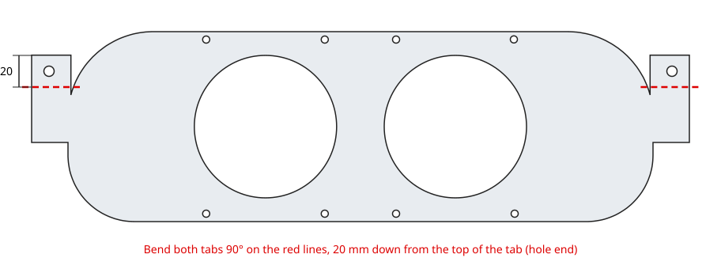
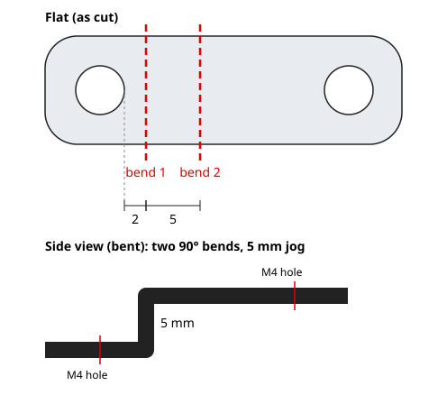

# Mechanical parts (laser cut)

Cut files for the dash pod and electronics brackets. The DXF drawings are in
millimetres.

| File | Part | Material | How it's made |
|---|---|---|---|
| `InstrumentCluster_RV1_1_cut3_SCS.dxf` | Instrument cluster plate: two 90 mm gauge openings, mounting tab each end (416 × 120 mm flat) | 16 gauge (1/16") cold rolled steel | SendCutSend, then bent (below) |
| `InstrumentCluster_RV1_1_cut4_SCS.dxf` | Screen bracket: joins a Waveshare screen to the back of cut3 (33 × 10 mm flat, two 4.5 mm holes) | 16 gauge (1/16") cold rolled steel | SendCutSend, then bent (below) |
| `SCS_BuckConverterForDash_Plate_V1_1.dxf` | Buck converter mounting plate (attaches to the screen; flat, no bends) | 1/16" ABS | Laser cut |
| `SCS_BuckConverterForDash_Plate2_V1_1.dxf` | Buck converter mounting plate 2 (attaches to the screen; flat, no bends) | 1/16" ABS | Laser cut |
| `CanBusCableHolder.xcs` | CAN bus wire management (attaches to the screen; flat, no bends) | 1/16" ABS | Laser cut (xTool Creative Space project) |
| `InstrumentClusterBracket1_v1_1.dxf` | Unconfirmed: same outline as the buck converter plate with different small holes | — | — |

## Ordering the steel parts from SendCutSend

Upload the `InstrumentCluster_*_SCS.dxf` files, confirm the units are
**millimetres** when the part preview loads (cut3 should show about 416 × 120 mm),
and choose **cold rolled steel, 16 gauge**. SendCutSend's 16 ga steel is nominally
0.060" (1.52 mm), close enough to 1/16" (0.0625") for these parts.

## Bending the instrument cluster plate (cut3)

Each end of the plate has a tab with a 6.5 mm hole near its top. Bend each tab
**90°** on a line **20 mm down from the top edge of the tab** (the end with the
hole). The tab is free of the main plate for its top 25 mm, so the bend line sits
5 mm above where the tab joins the plate; the 20 mm flap with the hole is what
folds over.

## Bending the screen brackets (cut4)

Two 90° bends in opposite directions make a **5 mm jog** (a Z shape):

1. **Bend 1:** 2 mm in from the edge of one hole, toward the middle of the part
   (about 9.3 mm from that end).
2. **Bend 2:** 5 mm past bend 1 (about 14.3 mm from the same end), back the other
   way, so the two hole ends finish parallel and 5 mm apart.

The holes sit almost exactly symmetric on the strip, so either end can be the start.

## Assembly hardware

| Joint | Hardware |
|---|---|
| Screen bracket (cut4) to Waveshare screen and to the back of cut3 | M4 × 5 mm screws |
| Buck converter to its ABS mounting plate | M2.5 × 5 mm standoffs, screws and nuts |
| Wires to the brackets | Small zip ties through the notches in the brackets |

Photos and full assembly steps will be added with the build guide.
